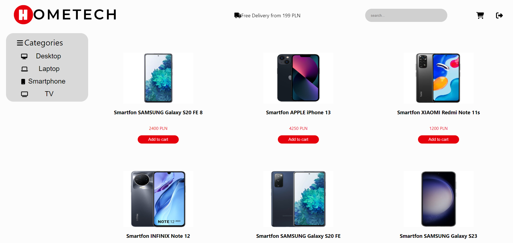
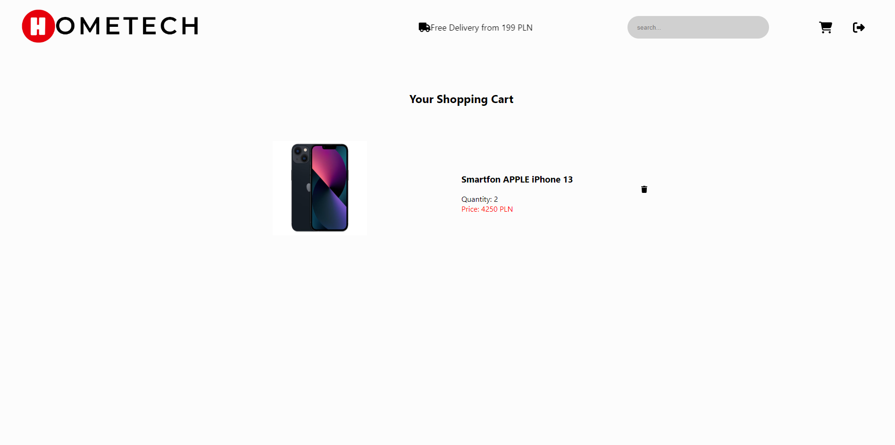

# HOMETECH

Website for people who want to buy electronic equipment.

## Features

- Secure user login and registration by using password hashing
- More precise selection thanks to the possibility of choosing the category of the product
- The ability to add items to the shopping cart and view it

## Technologies used
- Java
- Spring-boot
- Hibernate
- HTML
- CSS
- JS
- ReactJS
- PostgresSQL
- Git

## Team
- Rafał Ciupek

## Screenshots

